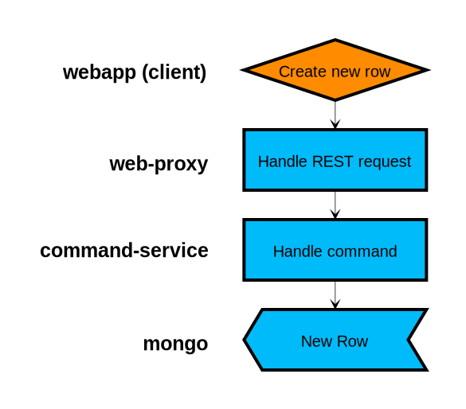
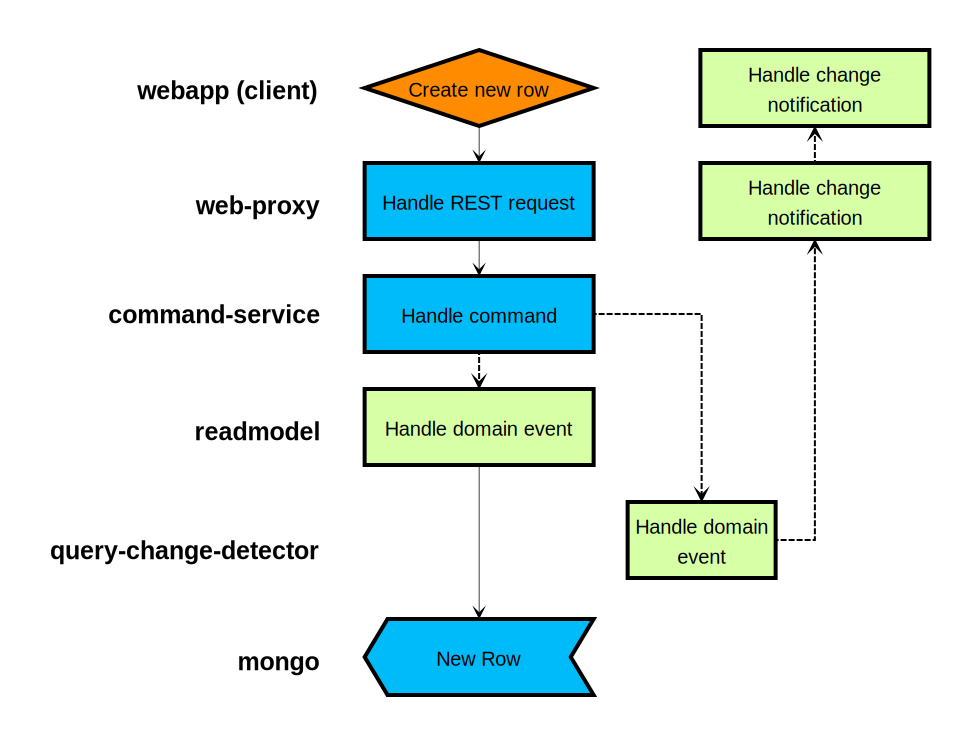
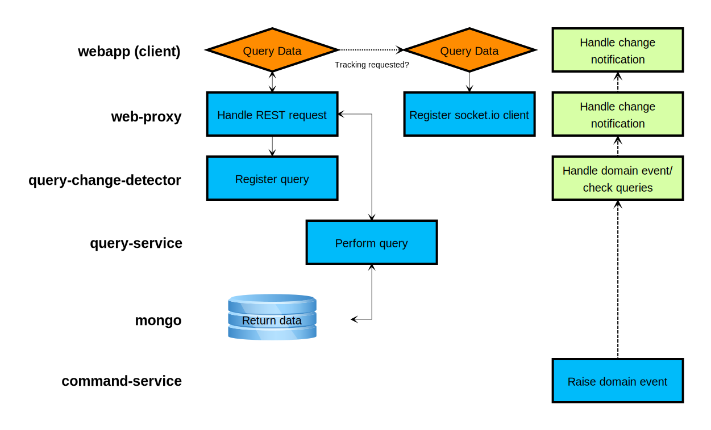

title: CQRS and Event Sourcing
subtitle:
class: animation-fade
layout: true

<!-- This slide will serve as the base layout for all your slides -->

.bottom-bar[
{{title}}
]

---

class: impact

# {{title}}

## {{subtitle}}

.title-oli[
Oliver Sturm &bull; @olivers &bull; oliver@oliversturm.com
]

.title-logo[

]

---

## Oliver Sturm

- Training Director at DevExpress
- Consultant, trainer, author, software architect and developer for over 25 years

- Contact: oliver@oliversturm.com

---

## Agenda

- CQRS - Why? When? How?
  - Sometimes there are choices
  - Sometimes the decision is natural
  - Consequences
- Event Sourcing
  - Again: Why? When? How?
- Eventual consistency

---

## Data Access, "Traditionally"

```cs
ImportantData editObject;

protected override void OnInit(EventArgs e) {
  editObject = LoadEditObject();
  control.DataSource = editObject;
  control.DataBind();
}

protected void Page_Load(object sender, EventArgs e) {
  if (IsPostBack) {
    MergeEditorChanges(editObject);
    SaveObject(editObject);
  } ...
}
```

---

## Data Access, "Traditionally"

1. Objects are loaded into memory
1. Data is shown in UI
1. Changes are submitted
1. Loaded objects are modified
1. Local change detection optimizes process of persistence

---

## CQRS &mdash; Why?

- Because _loading data for visualization_ doesn't have the same requirements as _persisting data_
- Because one _loading process_ can be _different_ from another
- Because one _persistence process_ can be _different_ from another
- Because we can save time in _page cycle_ environments
- Because separate execution paths are _easier to test and maintain_

---

## CQRS &mdash; When?

- Almost _anytime_!
- Typical doubts:
  - Pure client app &mdash; do I benefit?
  - More complex structure == more complicated maintenance work?
  - But what about ORM?
- Reality:
  - Structural advantages _benefit any architecture_
  - _Complex != complicated_, complex systems can have simple parts
  - Maybe we don't always need ORM...

---

## CQRS &mdash; How?

- _Separate execution paths_ for data reading and writing
- Consider modeling _changes as commands_
- Consider _efficient data models_ to support business operations

---

## Querying Data

.svg-light[

]

---

## Creating a New Row

.svg-light[

]

---

## Event Sourcing

- Starting from _command_ idea
  - Primarily _persist events_, instead of data
  - _Append-only_ event log
  - _Derive entity state_ at any time, for any point in time
- Entities/Aggregates/domain objects
- Optimizations: snapshots, projections, (persistent) read models

---

## Event Sourcing &mdash; Why?

- Events describe what the system was asked to do, any _technical consequences of an event are not set in stone_. Fantastic for long-term maintenance!
- Clean, extensible and scalable structure supports _strict separations of concerns_
- Event Storming &mdash; very practical planning method

---

## Event Sourcing &mdash; When?

- Tempting pattern for many applications, but with structural consequences (complexity)
- Very "clean complexity"
- _In real-world well structured service based apps generally a good recommendation_
- In-process, in full-fat clients? Possible...

---

## Event Sourcing &mdash; How?

- Easy part: _receive commands_
- Raising domain events across service boundaries requires _communication infrastructure_
- Persisting events and possibly read models requires a _persistence layer_
- Structural maintenance of _aggregates and projections_ is a bit fiddly, especially in typed languages
- Recommended: _use libraries existing for all platforms_

---

## Creating a New Row with CQRS/ES

.svg-light[

]

---

## Querying Data with CQRS/ES

.svg-light[

]

---

## Eventual Consistency

> Consistency is over-rated (Greg Young, Mr CQRS)

- General issue in distributed systems - CAP theorem
- Eventual consistency exists in the real world. Starbucks?
- How eventual are things in your system?
- Business logic needs to deal with issues resulting from eventual consistency
  - Compensation
  - Special programming tactics
  - Check this out: http://queue.acm.org/detail.cfm?id=2462076

---

## Sources

- This presentation:

  - https://oliversturm.github.io/cqrs-event-sourcing
  - PDF download: https://oliversturm.github.io/cqrs-event-sourcing/slides.pdf

- Demo code:

  - https://github.com/oliversturm/cqrs-grid-demo (check _event-sourcing_ branch)

- Talk to Seneca

  - https://github.com/oliversturm/talk-to-seneca

---

class: impact

# Thank You

Please feel free to contact me about the content anytime.

.title-oli[
Oliver Sturm &bull; @olivers &bull; oliver@oliversturm.com
]

.title-logo[

]
